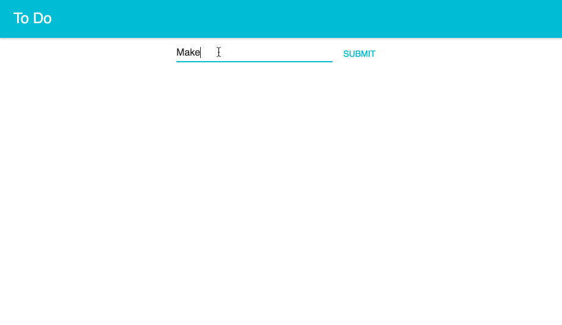

Simple Todo example created using Typescript, React, [Undux](https://github.com/bcherny/undux), and [Material-UI](http://www.material-ui.com/#/).

Special thanks to [bcherny](https://github.com/bcherny) for his [Undux Todo Example](https://github.com/bcherny/undux-todomvc)!
## Install

1. Install [NVM](https://github.com/creationix/nvm#installation)
2. Install Node 8: `nvm install v8.1.3`
3. Install [Yarn](https://yarnpkg.com/en/docs/install)
4. Clone this repo: `git clone https://github.com/akegan/typescript-todo.git`
5. Run it:

  ```sh
  cd typescript-todo
  yarn
  yarn build
  yarn start
  ```

6. Open *https://localhost:9000* in your browser

## See the app in action
